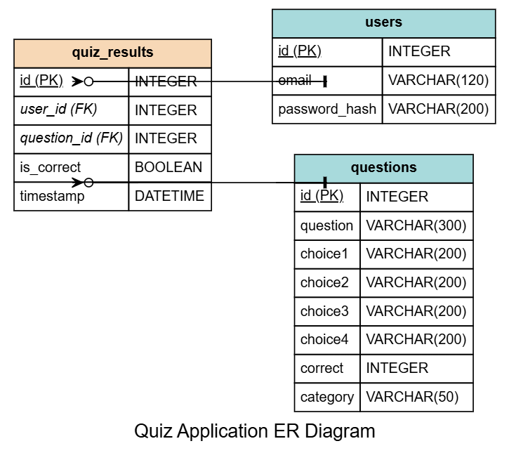
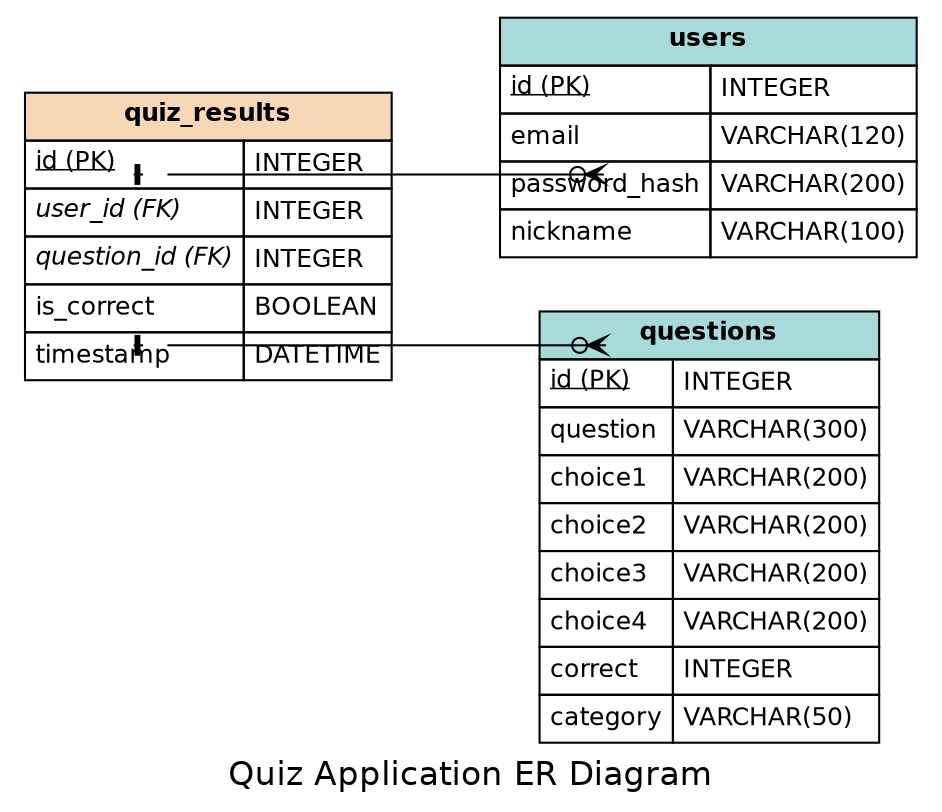
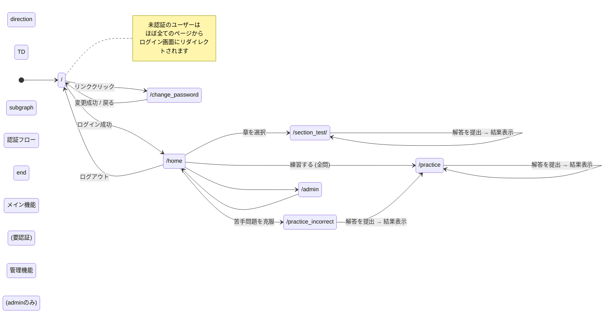

# プロジェクト仕様書: クイズアプリケーション（MyQuest）

## 更新日: 2025年12月23日

## 1. 概要

**MyQuest**は、Python公式チュートリアルに基づいたクイズを通じて、ユーザーがPythonの知識を学習・確認するためのWebアプリケーションです。利用者は章ごとのテストや、間違えた問題に特化した復習機能を通じて、効率的に学習を進めることができます。

## 2. 主な機能

### 2.1. ユーザー認証
- **ログイン/ログアウト**: 登録済みユーザーの認証管理

### 2.2. クイズ機能
ユーザーは複数のモードでクイズに挑戦できます。

1.  **セクション別テスト (`/section_test`)**
    - ユーザーは特定の章（カテゴリ）を選択し、その範囲の問題に挑戦します。
    - 解答後、正誤判定とスコアが表示されます。

2.  **練習モード (`/practice`)**
    - 全ての章からランダムに選ばれた問題が出題されます。

3.  **苦手問題の復習 (`/practice_incorrect`)**
    - 過去2回の挑戦で少なくとも1回間違えた問題に絞って出題されます。
    - ユーザーが苦手な部分を重点的に学習するための機能です。

### 2.3. 結果の追跡
- 全てのクイズ解答履歴はデータベースに保存されます。
- この履歴は、スコア計算や苦手問題の特定に利用されます。

### 2.4. 管理画面 (`/admin`)
`admin@example.com` でログインした際に利用可能な管理者向け機能です。以下の管理を行います。

- **ユーザー管理**:
  - 新規ユーザー登録
  - ユーザーのパスワード変更
  - ユーザーの削除
- **クイズコンテンツ管理**:
  - 問題文、選択肢、回答番号、解説文、関連URLの編集

### 2.5. ユーザー自身の情報更新
ログインしているユーザーは、自身の個人情報を更新できます。
- **ニックネームの登録・修正**: 表示名として使われるニックネームを登録、または修正します。
- **パスワードの変更**: 現在のパスワードを確認の上、新しいパスワードに変更します。

## 3. 技術スタック

- **バックエンド**: Python, Flask
- **データベース**: SQLite
- **ORM**: Flask-SQLAlchemy
- **フロントエンド**: HTML, Bootstrap 5
- **データソース**: `questions.json`

## 4. データベース設計 (データモデル)

データベースは `quiz.db` という名前のSQLiteデータベースファイルとして `instance/` ディレクトリに保存されます。
ORMにはFlask-SQLAlchemyを使用しており、モデルは `model.py` で定義されています。
データベースは以下の3つのテーブルで構成されます。

### 4.1. `users` テーブル

ユーザー情報を管理します。

| カラム名        | データ型          | 説明                                   | 制約                  |
| :-------------- | :---------------- | :------------------------------------- | :-------------------- |
| `id`            | `Integer`         | 主キー                                 | `primary_key=True`    |
| `email`         | `String(120)`     | ユーザーのメールアドレス（ログインID） | `unique=True`, `nullable=False` |
| `password_hash` | `String(200)`     | ハッシュ化されたパスワード             | `nullable=False`      |
| `nickname`      | `String(100)`     | ニックネーム（表示名）                 | `nullable=True`       |

### 4.2. `questions` テーブル

クイズの問題、選択肢、正解を管理します。

| カラム名    | データ型        | 説明                           | 制約               |
| :---------- | :-------------- | :----------------------------- | :----------------- |
| `id`        | `Integer`       | 主キー                         | `primary_key=True` |
| `question`  | `String(300)`   | 問題文                         | `nullable=False`   |
| `choice1`   | `String(200)`   | 選択肢1                        |                    |
| `choice2`   | `String(200)`   | 選択肢2                        |                    |
| `choice3`   | `String(200)`   | 選択肢3                        |                    |
| `choice4`   | `String(200)`   | 選択肢4                        |                    |
| `correct`   | `Integer`       | 正解の選択肢番号 (1-4)         |                    |
| `category`  | `String(50)`    | 問題のカテゴリ（章など）       |                    |

### 4.3. `quiz_results` テーブル

ユーザーごとのクイズの解答履歴を記録します。

| カラム名      | データ型   | 説明                                     | 制約                               |
| :------------ | :--------- | :--------------------------------------- | :--------------------------------- |
| `id`          | `Integer`  | 主キー                                   | `primary_key=True`                 |
| `user_id`     | `Integer`  | ユーザーID (`users.id`への外部キー)      | `ForeignKey('users.id')`, `nullable=False` |
| `question_id` | `Integer`  | 問題ID (`questions.id`への外部キー)    | `ForeignKey('questions.id')`, `nullable=False` |
| `is_correct`  | `Boolean`  | 正解したかどうか (True/False)            | `nullable=False`                   |
| `timestamp`   | `DateTime` | 解答した日時 (UTC)                       | `nullable=False`, `default=datetime.utcnow` |

### 4.4. テーブル間のリレーション

-   **`users` と `quiz_results`**:
    -   一人のユーザー (`User`) は複数の解答履歴 (`QuizResult`) を持つことができます (`1対多`)。
    -   `User.results` からそのユーザーの全解答履歴にアクセスできます。
-   **`questions` と `quiz_results`**:
    -   一つの問題 (`Question`) は複数の解答履歴 (`QuizResult`) を持つことができます (`1対多`)。
    -   `Question.results` からその問題に対する全解答履歴にアクセスできます。

### 4.5. データ関連図 (ER図 - Graphviz/DOT)



Graphviz (DOT言語) を使用して表現したER図です。



**記法の解説:**

この図は、カラスの足（Crow's Foot）記法を用いて、テーブル間の関係性を示しています。

-   **quiz_results -> users** の関係:
    -   `quiz_results`側の矢印の尾 (`arrowtail`) は `crowodot` で、「0以上、多数」を意味します。
    -   `users`側の矢印の頭 (`arrowhead`) は `tee` で、「1」を意味します。
    -   **意味**: 1件のクイズ結果は必ず1人のユーザーに属し、1人のユーザーは0件以上のクイズ結果を持つことができます (1対多)。

-   **quiz_results -> questions** の関係:
    -   `quiz_results`側の矢印の尾 (`arrowtail`) は `crowodot` で、「0以上、多数」を意味します。
    -   `questions`側の矢印の頭 (`arrowhead`) は `tee` で、「1」を意味します。
    -   **意味**: 1件のクイズ結果は必ず1つの問題に属し、1つの問題は0件以上のクイズ結果を持つことができます (1対多)。

-   `<U>PK</U>`: 主キー (Primary Key)
-   `<I>FK</I>`: 外部キー (Foreign Key)

## 5. プロジェクトのセットアップと実行

### 5.1. データベースの初期化とコンテンツの投入
1.  **ユーザー作成**:
    ```bash
    python create_users.py
    ```
    - スクリプトの指示に従い、管理者ユーザーを作成します。

2.  **問題のインポート**:
    ```bash
    python import_questions.py
    ```
    - `questions.json` ファイルからクイズの問題をデータベースにインポートします。

### 5.2. アプリケーションの起動
以下のコマンドで開発サーバーを起動します。

```bash
flask run
# または
python app.py
```
起動後、Webブラウザで `http://127.0.0.1:5000` にアクセスします。

## 6. 主要なファイル構成

- `app.py`: Flaskアプリケーション本体。ルーティング、ビュー関数、主要ロジックを定義。
- `model.py`: SQLAlchemyを使ったデータベースモデル（テーブルスキーマ）を定義。
- `database.py`: データベースインスタンスのセットアップ。
- `questions.json`: クイズの問題、選択肢、解答が格納されたJSONファイル。
- `import_questions.py`: `questions.json` を読み込み、データベースに登録するスクリプト。
- `create_users.py`: ユーザーを新規作成するためのスクリプト。
- `templates/`: HTMLテンプレート群。
- `instance/quiz.db`: SQLiteデータベースファイル。

## 7. 画面遷移図


以下にアプリケーションの主要な画面遷移を示します。



---

# `app.py` 設計解説書

## 1. 概要

このドキュメントは、Flaskで構築されたクイズアプリケーションのメインファイルである `app.py` のアーキテクチャと処理フローについて解説します。

### 1.1. アプリケーションの目的

このアプリケーションは、ユーザーがオンラインでクイズ学習を行うためのプラットフォームです。主な機能として、ユーザー認証、章ごとのテスト、および過去の演習問題への再挑戦機能を提供します。

### 1.2. 主要技術

-   **フレームワーク**: Flask
-   **データベース**: SQLite (SQLAlchemy ORM経由)
-   **テンプレートエンジン**: Jinja2
-   **主なPythonライブラリ**: `flask`, `flask_sqlalchemy`

### 1.3. 機能一覧

-   ユーザー認証（ログイン、ログアウト、パスワード変更）
-   章末テスト（カテゴリ別、ランダム10問）
-   過去問演習（全問題からランダム、不正解問題からランダム）
-   解答の即時正誤判定（非同期通信）: ユーザーが選択肢を選ぶと、ページを再読み込みせずに即座に正誤を画面に表示します。
-   解答結果の記録と表示
-   管理者向けページ

## 2. 起動と初期設定

アプリケーションの起動時に、以下の初期設定が行われます。

1.  **Flaskインスタンスの生成**:
    ```python
    app = Flask(__name__)
    ```

2.  **シークレットキーの設定**:
    セッション管理のために必須のシークレットキーを設定します。
    ```python
    app.secret_key = "test123"
    ```

3.  **データベース設定**:
    SQLAlchemyを使用してSQLiteデータベースに接続します。DBファイルはプロジェクト内の `instance/quiz.db` に配置されます。
    ```python
    basedir = os.path.abspath(os.path.dirname(__file__))
    app.config["SQLALCHEMY_DATABASE_URI"] = "sqlite:///" + os.path.join(basedir, "instance", "quiz.db")
    app.config["SQLALCHEMY_TRACK_MODIFICATIONS"] = False
    ```

4.  **SQLAlchemyの初期化**:
    Flaskアプリケーションと`db`オブジェクト（`database.py`で定義）を連携させます。
    ```python
    db.init_app(app)
    ```

5.  **テーブル作成**:
    アプリケーションコンテキスト内で、`model.py`に定義されたモデル（`User`, `Question`, `QuizResult`）に基づいてデータベーステーブルを自動生成します。
    ```python
    with app.app_context():
        db.create_all()
    ```

## 3. ルーティングと処理フロー

### 3.1. 認証フロー

ユーザーの認証はセッション（`flask.session`）を利用して管理されます。認証が必要なエンドポイントには、処理の冒頭でセッションの有無を確認する「認証ガード」が配置されています。

```python
if "user" not in session:
    return redirect("/")
```

#### `/` (GET) - ログイン画面
-   **処理**: `templates/login.html` をレンダリングして表示します。

#### `/try_login` (POST) - ログイン試行
1.  フォームから `email` と `password` を受け取ります。
2.  `User`テーブルを`email`で検索し、ユーザーを特定します。
3.  ユーザーが存在し、かつ提供されたパスワードが正しいか（`user.check_password(pw)`）を検証します。
4.  **認証成功**: セッションに `session["user"] = user.email` を保存し、ホーム画面 (`/home`) へリダイレクトします。
5.  **認証失敗**: エラーメッセージと共に `login.html` を再表示します。

#### `/logout` (GET) - ログアウト
1.  セッションから `user` キーを削除します。
2.  ログイン画面 (`/`) へリダイレクトします。

#### `/change_password` (GET, POST) - パスワード変更
-   **GET**: `templates/change_password.html` を表示します。
-   **POST**:
    1.  フォームから `email`, `current_password`, `new_password` を取得します。
    2.  `email` と `current_password` の正当性を検証します。
    3.  `new_password` が空でなく、確認用パスワードと一致するかを検証します。
    4.  **検証成功**: `user.set_password(new_password)` でパスワードハッシュを更新し、データベースにコミットします。その後、ログイン画面へリダイレクトします。
    5.  **検証失敗**: エラーメッセージと共に `change_password.html` を再表示します。

### 3.2. メイン機能フロー

#### `/home` (GET) - ホーム画面
-   **認証ガード**: ログインしていなければログイン画面へリダイレクトします。
-   **処理**: ログインユーザーの名前を `templates/home.html` に渡してレンダリングします。

#### `/home_action` (POST) - ホーム画面からの遷移
-   フォーム内のラジオボタンで選択された値（遷移先のURL）を取得し、そのURLへリダイレクトします。

### 3.3. 章末テスト機能

#### `/section_test/<category>` (GET) - テスト問題表示
-   **認証ガード**
-   URLから受け取った `category` に基づいて、`Question` テーブルから該当する問題を全て取得します。
-   問題リストから最大10問をランダムに抽出し、`templates/section_test.html` に渡して表示します。

#### `/submit_section_test` (POST) - テスト採点
1.  **認証ガード**
2.  フォームからユーザーの解答一式とカテゴリ名を取得します。
3.  `answer_<id>` というキー名から問題IDのリストを抽出します。
4.  問題IDリストを基に、`Question` テーブルから該当の問題オブジェクトを一括で取得します。
5.  ログイン中のユーザー情報を取得します。
6.  各問題について以下の採点処理をループ実行します。
    a. ユーザーの解答と `question.correct`（正解番号）を比較します。
    b. 正解ならスコアを加算します。
    c. 解答履歴を `QuizResult` オブジェクトとして生成し、DBセッションに追加します。
    d. 結果表示用のデータ（問題文、ユーザーの選択肢、正解の選択肢、正誤）をリストに格納します。
7.  ループ終了後、`db.session.commit()` で全ての解答履歴をデータベースに保存します。
8.  合計点と正答率を計算し、採点結果と共に `section_test.html` をレンダリングして結果を表示します。

#### `/check_answer` (POST) - リアルタイム解答チェック (非同期)
-   **認証ガード**
-   クライアントから送信されたJSON (`{ "question_id": id, "user_answer": ans }`) を受け取ります。
-   `question_id` で問題を検索し、`user_answer` と正解を比較します。
-   結果（正誤、正解番号、正解の選択肢テキスト）をJSON形式でクライアントに返します。この機能により、ページをリロードせずに正解を確認できます。

### 3.4. 過去問演習機能

#### `/practice` (GET, POST) - 全問題からの演習
-   **GET**:
    -   **認証ガード**
    -   `num` クエリパラメータで指定された数（デフォルト10）だけ、全ての問題からランダムに抽出し、`templates/practice.html` で表示します。
-   **POST**:
    -   章末テストの `/submit_section_test` と同様のロジックで採点と結果表示を行います。

#### `/practice_incorrect` (GET) - 不正解問題の復習
-   **認証ガード**
-   ログイン中のユーザーの全解答履歴 (`QuizResult`) を、問題IDとタイムスタンプでソートして取得します。
-   `itertools.groupby` を使って問題IDごとに履歴をグループ化します。
-   各グループ（問題ごと）に対して、以下のロジックで「復習対象」かを判定します。
    -   解答履歴が2回以上あり、かつ直近2回のうち少なくとも1回が不正解。
    -   解答履歴が1回のみで、それが不正解。
-   復習対象となった問題のリストから、`num` パラメータで指定された数をランダムに抽出し、`templates/practice.html` で表示します。

### 3.5. 管理者機能

#### `/admin` (GET) - 管理者ページ
-   **認証ガード** に加え、セッションのユーザーが `admin@example.com` であることを確認する二重のチェックを行います。
-   条件を満たす場合のみ `templates/admin.html` を表示します。